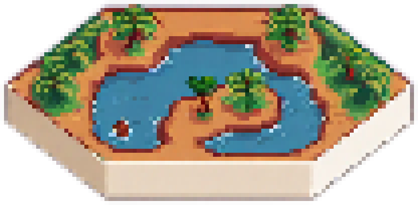
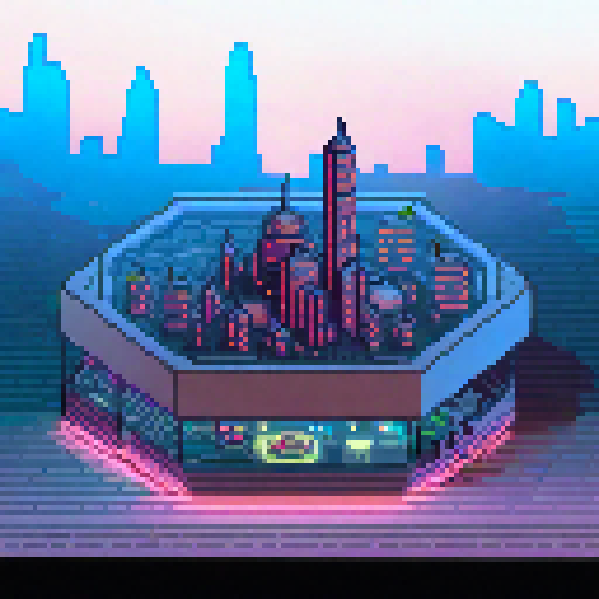
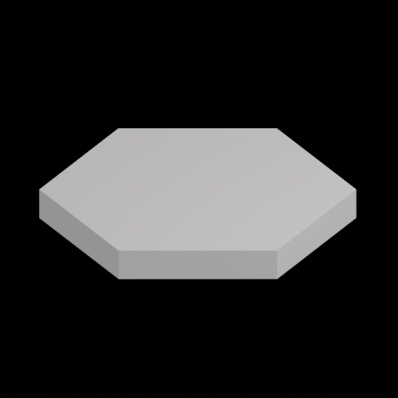
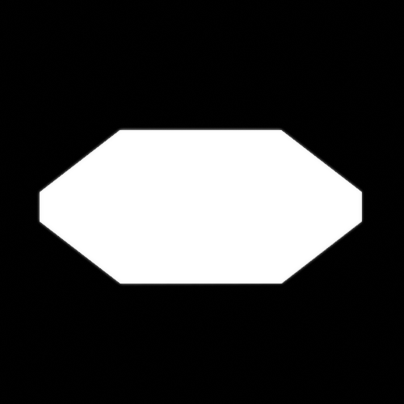

# Pixel perfect hexagon: Workflow

Unlock the Pixel Perfect Hexagon Magic: Your Go-To Workflow for Crafting Immaculate Hexagonal Tiles! 🎮✨

## Some example results:

| Result 1 | Result 2 |
|---------|---------|
|  |  |

| Base Image | Mask Image |
|---------|---------|
|  |  |

For a detailed explanation and to see more results, check out our YouTube video:

## Disclaimer for External Resources

This project may contain links to external resources, such as websites, libraries, or documentation, for reference or further information. Please note that we do not have control over the content or availability of these external resources. 

- We are not responsible for the accuracy, completeness, or legality of any information or content provided by these external resources.

- The inclusion of links to external resources does not imply endorsement or affiliation with the owners or creators of those resources. The responsibility for the content and functionality of external resources lies solely with their respective owners.

- We recommend exercising caution and discretion when accessing and using external resources. It is your responsibility to ensure the suitability and security of these resources for your specific purposes.

- We disclaim any liability for any direct or indirect damages, losses, or consequences that may arise from the use of external resources linked within this project.

By using this project and accessing external resources linked herein, you agree to this disclaimer and acknowledge that you do so at your own risk. 

## Getting Started

If you want to try this project out for yourself, follow these steps:

1. Install ComfyUI: 
2. Install SDXL 1.0 Model: 
3. Install LORAs:

4. Download the JSON Workflow from the Workflow folder
5. Load the Workflow JSON
6. Add the `Base Image` as input for the controllnet preprocessors on the left and `Mask Image` to the mask input on the very right
7. *Optional*: Add a reference image on the bottom to give the model a idea what it should create

## Contributing

If you'd like to contribute to this project, feel free to fork it and submit a pull request.

## License

This project is licensed under the MIT License - see the [LICENSE.md](LICENSE.md) file for details.